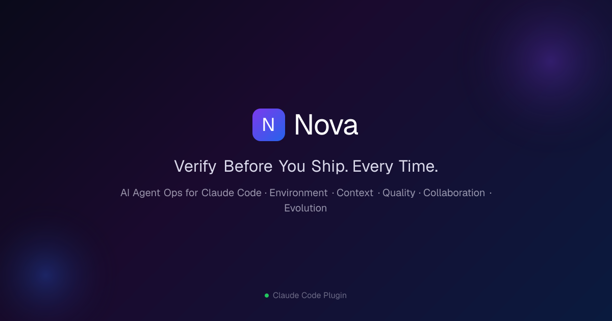

# Nova




> *Illustrative playback of the `/nova:review` + pre-commit gate flow. Source: [`assets/demo-play.sh`](assets/demo-play.sh) + [`assets/demo.cast`](assets/demo.cast).*

[](https://github.com/TeamSPWK/nova/actions/workflows/ci.yml)
[](https://github.com/TeamSPWK/nova/releases)
[](LICENSE)

**Self-only metrics** (n < threshold = gray-out, honest signal — see [`docs/guides/measurement.md`](docs/guides/measurement.md)) · **UI changes** gated by G1+G3 pair — see [`docs/guides/ui-quality-gate.md`](docs/guides/ui-quality-gate.md):
<!-- nova-metrics:badges:start -->
   
<!-- nova-metrics:badges:end -->

**Verify before you ship. Every time.**
AI-generated code, cross-checked by an independent adversarial evaluator — before commit, before deploy.

*A [Claude Code](https://claude.ai/code) plugin. 15 slash commands, 12 skills, 6 specialist agents, local MCP server.*

[한국어](README.ko.md) · [Install](#quick-start) · [How It Works](#how-it-works-examples) · [FAQ](#faq)

> AI coding tools make you type faster — but the real bottleneck isn't typing.
> A single wrong decision in week 1 compounds into a full rewrite by week 4.
> Nova gives AI agents the **operating environment** they need to work reliably.

Nova is a [Claude Code](https://claude.ai/code) plugin that makes AI agents operate **dependably** in real projects. It started as a Quality Gate — and that's still the strongest pillar — but it now spans five:

| Pillar | Purpose |
|--------|---------|
| **Environment** | Worktree, secret-sharing, isolated agent workspaces — see [Worktree Setup guide](docs/guides/worktree-setup.md) |
| **Context** | Session-to-session state continuity (`NOVA-STATE.md`) |
| **Quality** | Generator-Evaluator separation, pre-commit hard gate |
| **Collaboration** | Design→build→verify orchestration, multi-AI consulting |
| **Evolution** | Self-diagnosis and auto-upgrade |

The Quality pillar remains load-bearing: independent evaluation, multi-AI cross-verification, and design-implementation gap detection are injected into every session automatically.

## What's New in v5.23.0 — ECC Adversarial Gap Closure

A multi-release sprint that adopted measured ideas from the ECC (Everything Claude Code) ecosystem while preserving Nova's cohesive identity. **Identity is discovered after the mechanism proves itself, not declared upfront** — the additions below were absorbed because they passed adversarial evaluation, not because of vocabulary fit.

| Release | Addition | Source |
|---------|----------|--------|
| **v5.23.0** | `/nova:audit-self --jury` — Red(attacker) / Blue(defender) / Auditor(arbiter) 3-persona adversarial security audit. Counters single-evaluator self-justification bias. | ECC AgentShield §P2-3 |
| **v5.22.3** | `release.sh` Step 2.5 hygiene gates — fail-open advisories for review trail / `NOVA-STATE.md` freshness / audit-self regression integration | Self-gap (Always-On 4 enforcement) |
| **v5.22.2** | `audit-self` rule sensitivity layer (T11–T25) — 15 inline violation fixtures prove rules catch intended patterns. Self-discovered jq escape bug in T13. | Self-discovered via meta-loop |
| **v5.22.1** | `hooks/session-start.sh` MCP load alert — caches `claude mcp list` 1h, surfaces ⚠️ when >10 servers active | ECC §P1-2 (10/80 rule) |
| **v5.22.0** | `/nova:audit-self` command + 30-rule security rulebook (5 categories: plugin/hooks/agents/skills/commands). Generator-Evaluator separation applied to Nova's own codebase. | ECC AgentShield §P1-1 |

**Closed**: Known Risks Medium (release.sh review-trail gate) and Info (audit-self rule sensitivity). **Identity layer untouched** — five pillars, slogan, Generator-Evaluator separation, NOVA-STATE 9-entry continuity all intact. See [docs/proposals/2026-04-29-ecc-adversarial-gap.md](docs/proposals/2026-04-29-ecc-adversarial-gap.md) for the full adoption rationale and what was deliberately rejected (183-skill quantity race, auto-promotion, 100% PreToolUse observation).

## Quick Start

### Codex Desktop / CLI (Beta)

```bash
# Install Nova with the recommended Codex plugin set
curl -fsSL https://raw.githubusercontent.com/TeamSPWK/nova/main/scripts/install-codex-recommended-plugins.sh | bash
```

Restart Codex after installation. See the [Codex plugin install guide](docs/guides/codex-plugins.md) for options and troubleshooting.

> In Codex Phase 1, Nova skills and MCP tools are available. Claude Code-only hooks and slash-command differences are covered in the install section below.

For repositories that already use `CLAUDE.md`, keep `AGENTS.md` as a thin Codex bridge:

```md
Before repository work, use the Nova `repo-preflight` skill.
Project-specific instructions live in `CLAUDE.md`.
```

To reorganize `CLAUDE.md`, `AGENTS.md`, rules, settings, and hooks without turning one file into a catch-all, run `/nova:claude-md`. It starts with a short guide and audits the current repo without editing files. See the [Agent Instruction Guide](docs/guides/claude-md.md) for the placement rules.

### Claude Code

```bash
# Install (30 seconds)
claude plugin marketplace add TeamSPWK/nova
claude plugin install nova@nova-marketplace

# Start
/nova:next   # Shows what to do next
```

## What Is Nova?

Nova is a **checkpoint inside the AI orchestrator loop**. It verifies that generated code is correct, and orchestrates complex multi-step workflows when needed.

```
┌─────────────────────────────────────────────────┐
│  User Request                                    │
│       ↓                                          │
│  ┌──────────┐    ┌──────────┐    ┌──────────┐   │
│  │ Generator │───→│  Nova    │───→│Done/Fix  │   │
│  │ (Build)   │    │ (Verify) │    │          │   │
│  └──────────┘    └──────────┘    └──────────┘   │
│                       ↑                          │
│              Independent subagent                │
│              Adversarial stance                  │
└─────────────────────────────────────────────────┘
```

The core principle is **Generator-Evaluator Separation**: the agent that writes code and the agent that verifies it are always different. This prevents the "reviewing your own homework" trap.

## Architecture: Harness Engineering

Nova works by engineering Claude Code's **harness layer** — the hooks, commands, agents, and skills system that wraps around the LLM. Instead of changing what the model knows, Nova controls **when, how, and under what rules** the model operates.

```
┌─────────────────────────────────────────────────────┐
│  Claude Code Harness                                 │
│                                                      │
│  ┌─────────────────┐   SessionStart hook             │
│  │ session-start.sh │──→ Injects 10 rules as         │
│  │                  │    LLM context every session    │
│  └─────────────────┘                                 │
│                                                      │
│  ┌─────────────────┐   slash commands                │
│  │ .claude-plugin/  │──→ /nova:plan, /nova:review,    │
│  │   *.md           │    /nova:check, /nova:run ... │
│  └─────────────────┘                                 │
│                                                      │
│  ┌─────────────────┐   5 specialist subagents        │
│  │ .claude-plugin/  │──→ architect, senior-dev,       │
│  │   agents/*.md    │    qa-engineer, security, devops │
│  └─────────────────┘                                 │
│                                                      │
│  ┌─────────────────┐   5 complex skills              │
│  │ skills/*/SKILL.md│──→ evaluator, jury,             │
│  │                  │    context-chain, field-test,   │
│  │                  │    orchestrator                 │
│  └─────────────────┘                                 │
└─────────────────────────────────────────────────────┘
```

| Layer | File | Mechanism | What It Does |
|-------|------|-----------|-------------|
| **Rules injection** | `hooks/session-start.sh` | SessionStart hook | Injects 10 auto-apply rules into every session as LLM context |
| **Commands** | `.claude-plugin/*.md` | Slash commands | User-invocable workflows (`/nova:plan`, `/nova:review`, `/nova:check`, etc.) |
| **Agents** | `.claude-plugin/agents/*.md` | Subagent types | Specialist agents with domain-specific checklists |
| **Skills** | `skills/*/SKILL.md` | Skill system | Complex multi-step operations (evaluation, jury, context chain, orchestration) |
| **MCP Server** | `mcp-server/` | stdio MCP | Exposes Nova rules, state, and tools to any Claude Code session |

**Key distinction**: "Auto-apply rules" means `session-start.sh` injects rule text into Claude's context at session start. Claude then follows these rules as behavioral guidelines — it's prompt-level governance via the harness, not a code-level interceptor.

## Workflow

### Auto Workflow (Natural Language)

Once installed, Nova's Quality Gate **automatically applies to every conversation** — no commands needed. Just describe your task in natural language.

```
"Build a feature" ──→ Auto complexity assessment
                              │
              ┌───────────────┼───────────────┐
              ▼               ▼               ▼
           [Simple]        [Medium]        [Complex]
              │               │               │
           Implement       Plan→Approve    Plan→Design
              │               │            →Sprint split
              │            Implement        →Approve
              │               │               │
              ▼               ▼               ▼
        ┌──────────┐    ┌──────────┐    ┌──────────┐
        │Evaluator │    │Evaluator │    │Evaluator │
        │  Lite    │    │ Standard │    │  Full    │
        └──────────┘    └──────────┘    └──────────┘
              │               │               │
           [PASS]          [PASS]          [PASS]
              ↓               ↓               ↓
            Done             Done            Done
```

### Manual Workflow (Commands)

```
/nova:plan → /nova:ask (if needed) → /nova:design → Build → /nova:check
```

## How It Works: Examples

### Example: "Build a login API"

```
User: "Build a login API"
         ↓
Nova auto-judges:
  1. Complexity → "Auth domain, escalate → Medium"
  2. Writes Plan → Waits for user approval
  3. After approval → Implements
  4. Independent Evaluator subagent runs adversarial review
     → "jwt_secret_key hardcoded → Hard-Block"
  5. Hard-Block found → Reports to user immediately
```

### Example: "Fix this bug" (Simple)

```
User: "Fix the NullPointerException"
         ↓
Nova auto-judges:
  1. Complexity → "1 file, clear bug → Simple"
  2. Fixes immediately
  3. Independent Evaluator runs Lite verification
  4. PASS → Done
```

### Example: "Refactor entire auth system" (Complex)

```
User: "Switch from JWT to session-based auth"
         ↓
Nova auto-judges:
  1. Complexity → "8+ files, auth domain → Complex"
  2. Plan → Design → User approval
  3. Sprint split (Sprint 1: Session model, Sprint 2: Middleware, ...)
  4. Per-sprint: Implement → Evaluate loop
  5. Full verification → Done
```

## Auto-Apply Rules (10 Rules)

These rules apply to every conversation the moment Nova is installed. They are injected as LLM context via the `session-start.sh` hook.

### 1. Automatic Complexity Assessment

| Complexity | Criteria | Auto Behavior |
|-----------|----------|--------------|
| **Simple** | 1-2 files, clear bug | Implement → Evaluator Lite |
| **Medium** | 3-7 files, new feature | Plan → Approve → Implement → Evaluator Standard |
| **Complex** | 8+ files, multi-module | Plan → Design → Sprint split → Evaluator Full |

- Auth/DB/Payment domains escalate one level regardless of file count
- Re-assess if file count exceeds initial estimate during work

### 2. Generator-Evaluator Separation + Pre-Commit Gate (Core)

- Implementation (Generator) and verification (Evaluator) are **always separate agents**
- Evaluator takes an adversarial stance: "Find problems, don't rubber-stamp"
- Lite verification by default; full verification only with `--strict`

**Pre-commit gate**: Implementation complete → tsc/lint pass → Evaluator run → PASS → commit allowed. No deploy before Evaluator PASS (exception: `--emergency`).

### 3. Verification Criteria (5 Dimensions)

| Criterion | What It Checks |
|-----------|---------------|
| **Functionality** | Does it actually work? (compared against requirements) |
| **Data Flow** | Input → Store → Load → Display → Deliver to user — complete? |
| **Design Alignment** | Consistent with existing code/architecture? |
| **Craft** | Error handling, edge cases, type safety |
| **Boundary Values** | Does it survive 0, negative, empty string, max values without crashing? |

### 4. Execution Verification First

- "Code exists" ≠ "Code works"
- "Tests pass" ≠ "Verified" — boundary values must be checked separately
- Environment changes follow 3 steps: Check current → Change → Verify applied

### 5–10. Additional Rules

| Rule | Description |
|------|------------|
| **§5 Lightweight Verification** | Default is Lite. Full verification only with `--strict` |
| **§6 Sprint Split** | 8+ file changes split into independently verifiable sprints |
| **§7 Blocker Classification** | Auto-Resolve / Soft-Block / Hard-Block. Forced classification after 2 repeated failures |
| **§8 NOVA-STATE.md** | Immediate update on deploy/test/sprint/blocker/eval results. Known Gaps required |
| **§9 Emergency Mode** | `--emergency` skips Plan/Design. Fix now, verify after |
| **§10 Environment Safety** | Never edit config files directly. Use env vars or CLI flags |

## Commands

Commands provide **additional control** on top of auto-apply rules.

<!-- AUTO-GEN:commands -->
| Command | Description |
|---------|------------|
| `/nova:ask` | Run multi-AI consultation. Queries Claude + GPT + Gemini in parallel and analyzes the consensus level. |
| `/nova:audit-self` | Nova 플러그인 자기 코드(plugin.json/hooks/agents/skills/commands)에 대한 정적 보안 진단을 수행한다. 30+ 룰셋 5 카테고리, security-engineer → evaluator 직렬 검증, 메인 사실 검증 회로. ECC AgentShield 영감. |
| `/nova:auto` | Auto-run a natural-language request through the full design → implement → verify → fix cycle. |
| `/nova:check` | Combined code review + design-implementation gap verification in one pass. |
| `/nova:claude-md` | Show a guided intro, audit CLAUDE.md/AGENTS.md instructions, and propose a new/existing project reorganization. |
| `/nova:deepplan` | Generate a deep Plan document via an Explorer → Synth → Critic → Refiner 4-stage pipeline. |
| `/nova:design` | Write a Design document using the CPS (Context-Problem-Solution) framework. |
| `/nova:evolve` | Scan tech trends and auto-evolve Nova. Changes are verified by Nova's own quality gate on your behalf. |
| `/nova:next` | Diagnose current project state and recommend the next Nova command to run. |
| `/nova:plan` | Write a Plan document using the CPS (Context-Problem-Solution) framework. |
| `/nova:review` | Review code adversarially and surface hidden issues. |
| `/nova:run` | Run the implement → verify full cycle. Use --verify-only to run verification alone. |
| `/nova:scan` | Auto-analyze a codebase on first entry and brief you on 'where to start looking'. |
| `/nova:setup` | Initial Nova Quality Gate setup for a new project, or auto-fill gaps in an existing project (--upgrade). |
| `/nova:status` | View project status (Phase/Sprint/group progress) + drift alerts as a stand-alone HTML. |
| `/nova:ux-audit` | Deep UI/UX evaluation via 5 adversarial reviewers — accessibility (WCAG 2.2), cognitive load, performance (Core Web Vitals), and dark patterns (EU DSA) analyzed from code. |
| `/nova:worktree-setup` | Instantly symlink the main repo's .env, secrets, and config files into the current worktree. Manual retry of the SessionStart auto-hook. |
<!-- /AUTO-GEN:commands -->

## Self-Evolution

Nova evolves itself. `/nova:evolve` scans tech trends, filters by Nova relevance, and proposes or applies improvements automatically.

```bash
/nova:evolve              # Scan trends + generate proposals (default)
/nova:evolve --apply      # Implement proposals + quality gate
/nova:evolve --auto       # scan + apply + auto-merge within scope
```

### Autonomy Policy

| Level | Example | Automation |
|-------|---------|-----------|
| **patch** | Docs improvement, checklist updates | Auto-commit |
| **minor** | New verification criteria, hook improvements | PR creation |
| **major** | New commands, architecture changes | Proposal only |

### Automatic Schedule

Runs automatically via Claude Code remote agent **every Mon/Wed/Fri at 06:00 KST**.

Manage: https://claude.ai/code/scheduled

## MCP Server

Nova includes a local MCP (Model Context Protocol) server that exposes Nova's rules, state, and tools to any Claude Code session — even outside the Nova project.

### Setup

```bash
cd mcp-server && pnpm install && pnpm build
```

The `.mcp.json` at project root auto-registers the server with Claude Code.

### Available Tools

| Tool | Description |
|------|------------|
| `get_rules` | Returns Nova rules (full or by section §1-§9) |
| `get_commands` | Lists all slash commands with descriptions |
| `get_state` | Reads NOVA-STATE.md from any project path |
| `orchestrate` | Returns agent formation guide by complexity |
| `repo_preflight` | Finds CLAUDE.md/AGENTS.md/NOVA-STATE.md before repository work |
| `x_verify` | Runs configured multi-AI cross-verification |
| `orchestration_start` / `orchestration_update` / `orchestration_status` | Tracks Nova orchestration phases |

### How It Works

```
Any Project ──→ Claude Code ──→ Nova MCP Server (localhost, stdio)
                                    │
                                    ├── get_rules()     → Full Nova ruleset
                                    ├── get_state()     → NOVA-STATE.md
                                    ├── repo_preflight()→ CLAUDE.md/AGENTS.md bridge
                                    └── orchestrate()   → Agent team guide
```

The MCP server reads files directly from the Nova installation directory. No API calls, no external dependencies.

## Skills

Skills are multi-step operations that commands invoke internally. They can also be called directly.

<!-- AUTO-GEN:skills -->
| Skill | Description |
|-------|------------|
| **claude-md** | Use when CLAUDE.md, AGENTS.md, or other agent instruction files must be created or reorganized for a new or existing project. |
| **context-chain** | Use when session-to-session context must carry over. |
| **deepplan** | Use when a Plan's search breadth or verification depth is insufficient and a deeper Plan is needed. |
| **evaluator** | Use when code implementation must be verified from an adversarial stance. |
| **evolution** | Use when evolving Nova itself. |
| **field-test** | Use when validating the Nova methodology on real projects to find improvement points. |
| **jury** | Use when single-Evaluator bias is a concern and an important judgment needs a multi-perspective re-review. |
| **orchestrator** | Use when a natural-language request needs the entire development cycle auto-handled. |
| **repo-preflight** | Use when project instructions must be checked before repository work. |
| **status-dashboard** | Render project status as stand-alone HTML dashboard. |
| **strategic-compact** | Use when you must decide whether to /clear or /compact the session context. |
| **ux-audit** | Use when UI/UX quality must be validated adversarially from multiple perspectives. |
| **worktree-setup** | Use when the main repo's environment setup is needed inside a git worktree. |
| **writing-nova-skill** | Use when authoring a new Nova skill or revising an existing skill's description. |
<!-- /AUTO-GEN:skills -->

## Specialist Agents (5 Types)

Each agent has a built-in Nova self-check checklist.

<!-- AUTO-GEN:agents -->
| Agent | Description |
|-------|------------|
| `architect` | For system architecture design, technology selection, and scalability/maintainability review |
| `devops-engineer` | For CI/CD pipelines, infrastructure setup, deployment strategy, and monitoring configuration |
| `qa-engineer` | For test strategy, edge-case identification, and quality verification |
| `refiner` | Takes evaluator FAIL output and proposes fixes |
| `security-engineer` | For security vulnerability review, threat modeling, and auth/authorization review |
| `senior-dev` | For code quality improvement, refactoring, implementation strategy, and tech debt identification |
<!-- /AUTO-GEN:agents -->

## Session State (NOVA-STATE.md)

Nova maintains context across sessions via `NOVA-STATE.md`. If it doesn't exist, it is auto-generated at session start.

```markdown
# NOVA-STATE — project-name

## Current
- **Goal**: JWT → Session-based auth migration
- **Phase**: building
- **Blocker**: none

## Recently Done
| Task | Completed | Verdict |
|------|-----------|---------|
| Sprint 1: Session model | 2026-04-01 | PASS |

## Known Gaps
| Area | Uncovered | Priority |
|------|-----------|----------|
| Concurrent session limit | Not implemented | Medium |
```

- Located at project root (git root)
- Updated immediately on deploy/test/sprint/blocker/eval results
- "ALL PASS" alone is not enough — Known Gaps must be included

## Blocker Classification

Nova auto-classifies issue severity.

| Classification | Condition | Response |
|---------------|-----------|----------|
| **Auto-Resolve** | Reversible without external changes | Auto-fix |
| **Soft-Block** | May fail at runtime | Log and continue |
| **Hard-Block** | Data loss, security, user misjudgment | **Stop immediately**, ask user |

Code review additional criteria:
- Runtime crash → Hard-Block
- Data corruption / integrity violation → Hard-Block
- User misjudgment (wrong amount/status displayed) → Hard-Block
- Same failure repeated 2x → Forced blocker classification

## What Nova Catches

Our CI runs a [self-verification test](tests/test-self-verify.sh) against intentionally flawed code:

| Defect | Type | Detection Method |
|--------|------|-----------------|
| Missing `GET /api/auth/me` endpoint | Design-Implementation Gap | Design doc vs route handler diff |
| Plaintext password storage | Security | Design requires bcrypt, no hashing in code |
| No email duplicate check (missing 409) | Verification Contract Breach | Design specifies 409, no conflict handling |
| Hardcoded JWT secret key | Security Pattern | Static analysis: string literal |

## API Keys (Optional)

Only `/nova:ask` (multi-perspective collection) requires API keys. Everything else works without them.

```bash
cat > .env << 'EOF'
OPENAI_API_KEY="your-key"
GEMINI_API_KEY="your-key"
EOF
```

## Install / Update / Remove

```bash
# Install
claude plugin marketplace add TeamSPWK/nova
claude plugin install nova@nova-marketplace

# Update
claude plugin update nova@nova-marketplace

# Remove
claude plugin uninstall nova@nova-marketplace
claude plugin marketplace remove nova-marketplace
```

### Codex Desktop / CLI (Beta)

Nova provides a separate manifest for [Codex](https://github.com/openai/codex) users. Skills and MCP are available in Phase 1.

The recommended plugin set (Browser Use, Documents, Spreadsheets, Presentations, Nova) can be installed with one command. See the [Codex plugin install guide](docs/guides/codex-plugins.md) for troubleshooting and options.

```bash
curl -fsSL https://raw.githubusercontent.com/TeamSPWK/nova/main/scripts/install-codex-recommended-plugins.sh | bash
```

For manual installation, use the steps below.

```bash
# 1) Add the Nova marketplace
codex plugin marketplace add TeamSPWK/nova

# For local development, point Codex at your clone instead:
codex plugin marketplace add /absolute/path/to/nova

# 2) Build the MCP server dependencies in the installed marketplace root
#    (the add command prints the installed root path)
cd <installed-marketplace-root>/mcp-server && pnpm install && pnpm build
```

Then enable `nova@nova-marketplace` in the Codex plugin UI. If you prefer editing config directly, make sure the plugin has first been installed or materialized in Codex's plugin cache:

```toml
# ~/.codex/config.toml
[plugins."nova@nova-marketplace"]
enabled = true
```

For team setup, this repository also includes an installer that registers Nova, materializes the plugin cache, enables the recommended Codex plugins, and adds a Nova MCP fallback:

```bash
bash scripts/install-codex-recommended-plugins.sh --local /absolute/path/to/nova
```

> **Note**: The `session-start.sh` hook (10 auto-apply rules) is a Claude Code-only feature and **does not work with Codex CLI**. Slash commands (`/nova:*`) and specialist agents are also unavailable in Phase 1. Use Nova skills and MCP tools instead; call `get_rules()` when you need the full rulebook.

**MCP registration fallback** — only use this if the bundled `.codex-plugin/.mcp.json` does not auto-load:

```toml
# ~/.codex/config.toml
[mcp_servers.nova]
command = "node"
args = ["/absolute/path/to/nova/mcp-server/dist/index.js"]
```

## FAQ

### When should I NOT use Nova?

- **One-line fixes**: Typos, version bumps — no CPS needed
- **Clear bug fixes**: Stack trace points to cause? Just fix it
- **Throwaway prototypes**: Skip the process
- **Tasks under 30 minutes**: If the cycle takes longer than the task, it's overhead

**Rule of thumb**: If you can hold the entire change in your head, you don't need Nova.

### Can `/nova:ask` multi-AI consensus be wrong?

Yes. Claude, GPT, and Gemini share much training data. Even unanimous agreement may reflect a shared blind spot. The final call is always yours.

### How does Nova work with AI orchestrators?

Nova is a Quality Gate — it verifies, not orchestrates. The orchestrator builds, Nova checks. It's the checkpoint inside their loop, integrated via Claude Code's harness layer.

### What is the MCP server for?

The MCP server lets any Claude Code session access Nova's rules and orchestration guides — even in projects that don't have Nova installed as a plugin. It's a "Nova brain" that's always available locally.

### What is "harness engineering"?

Prompt engineering shapes *what* the model says. Harness engineering shapes *when, how, and under what rules* the model runs — using hooks, plugins, commands, and agents. Nova is a harness engineering tool: it governs AI behavior through Claude Code's plugin system rather than through prompt manipulation.

## Documentation

- [Usage Guide](docs/usage-guide.md) — Detailed command and agent reference
- [Agent Instruction Guide](docs/guides/claude-md.md) — How `/nova:claude-md` splits CLAUDE.md, AGENTS.md, rules, settings, and hooks
- [Skill Governance Guide](docs/guides/skill-governance.md) — Selectively disable Nova skills via `skillOverrides` (CC v2.1.126+)
- [Nova Engineering](docs/nova-engineering.md) — Full methodology (4 Pillars, CPS, security)
- [Tutorial: Todo API](examples/tutorial-todo-api.md) — End-to-end workflow walkthrough

## Requirements

- [Claude Code](https://claude.ai/code) CLI
- API keys: OpenAI + Google AI Studio (optional, for `/nova:ask` only)

## License

MIT — [Spacewalk Engineering](https://spacewalk.tech)
