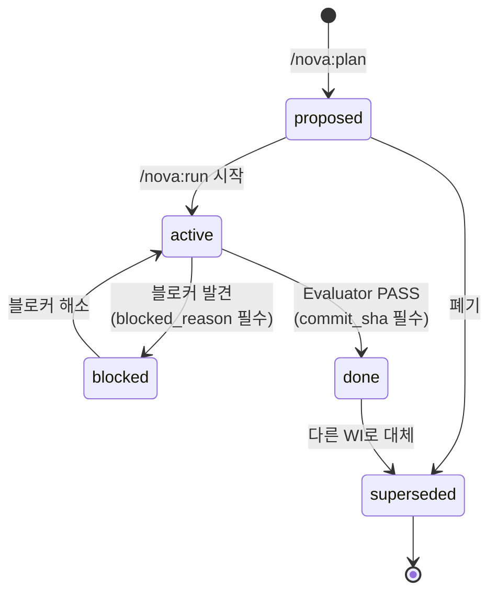

# Nova v3 — 5분 시작 가이드

> 누구나 이해할 수 있는 Nova work-item registry 입문서.
> 개발 경험 없어도 OK. AI와 함께 일하는 모든 사람을 위한 가이드.

## TL;DR — 한 줄로

**AI 에이전트의 "오늘 뭐 했는지·다음 뭐 할지"를 기계가 읽을 수 있게 정리한 시스템**입니다.

```
🧑 사람용 cursor:  NOVA-STATE.md      ← 매일 한 번 보는 곳
🤖 기계용 진실원:  .nova/work-items/  ← AI가 자동으로 관리
```

사용자는 NOVA-STATE.md 한 파일만 보면 충분. 슬래시 커맨드(`/nova:plan`, `/nova:run` 등)가 나머지 자동 처리.

---

## 왜 필요한가요?

### 기존 문제 (Nova v1/v2)

```
프로젝트 A:                          AI 에이전트:
NOVA-STATE.md (사람 손편집)    ←→   "오늘 뭐부터 시작하지?"
- Tasks: 검색 기능 추가              → NOVA-STATE.md 읽음
- Done: 로그인 (5/10 PASS)           → "검색 기능" 본격 작업
- ...                                → 사람이 STATE 갱신 깜빡
                                     → 다음 날 같은 작업 또 추천 ❌
```

**증상**:
- 📉 NOVA-STATE.md가 wiki처럼 커짐 (점점 더러워짐)
- 🔁 AI가 stale 정보로 같은 작업 반복 추천
- 🤷 "이거 끝났는데 왜 또?" — 사용자가 매번 손으로 정리
- 📊 진척 측정 불가 (DORA 지표 없음)

### v3 해결


**핵심 분리**:
- 사람용 cursor = 자유로운 손편집 영역 + 자동 렌더 영역
- 기계용 진실원 = JSON Schema 검증된 work-item
- 두 영역이 *단방향 투영*만 — 양방향 동기화 X (충돌 방지)

---

## 5분 시작 (3 단계)

### 시나리오 A: 새 프로젝트

```bash
cd ~/my-project
/nova:setup
```

자동으로:
- `.nova/{schema,work-items,README.md}` 생성
- `.gitignore`에 Nova marker 블록 추가
- 빈 매니페스트 `index.json` (next_seq=1)

→ 끝. 이후 `/nova:plan`, `/nova:run` 사용 시 AI가 자동으로 work-item 발급.

### 시나리오 B: 기존 v1/v2 STATE 프로젝트 마이그레이션

```bash
cd ~/existing-project
/nova:migrate-state
```

자동 흐름:
1. NOVA-STATE.md schema 감지 (v1 frontmatter 없음 / v2 `schema_version: 2`)
2. dry-run 미리보기 (보존율 + WI 분포 보고)
3. 사용자 검수 (4지선다: A=apply / B=중단 / C=가이드 / D=skip)
4. A 선택 → `--apply` 실행 + drift-check 자동 검증

**보존율 보고 예시**:
```
[migrate-v3] v2 STATE 파싱 완료:
[migrate-v3]   Tasks: 5, Recently Done: 3, Known Gaps: 2, Active Tree: 0
[migrate-v3]   → 변환 대상 work-item: 10개 (done w/ sha: 2, proposed 강등: 1)
[migrate-v3] 보존율 (a) 항목 수: 100.0% (10/10)
```

### 시나리오 C: 평상시 사용

사용자는 평소 그대로 슬래시 커맨드 사용. 내부에서 work-item 자동 관리:

```
사용자 입력                  AI 자동 처리
─────────                  ────────────────────
/nova:plan "검색 추가"     →  WI-0042-add-search 생성 (status=proposed)
/nova:design               →  source_docs 갱신
/nova:run                  →  구현 + Evaluator → status=done + commit_sha
/nova:review               →  review_required=true 플래그
/nova:check                →  drift 18 룰 자동 검증
```

**사용자는 NOVA-STATE.md marker 영역만 보면 됨**:
```markdown
<!-- nova:registry-rendered:start -->
**Active Tree** (registry: 3 work-items, 갱신: 2026-05-16T10:00:00Z):

- 🔄 [WI-0042-add-search](.nova/work-items/WI-0042-add-search.json) — high
- ⬜ [WI-0043-fix-payment](.nova/work-items/WI-0043-fix-payment.json) — medium · review_required ⚠️
- ⬜ [WI-0044-doc-update](.nova/work-items/WI-0044-doc-update.json) — low

**Recent Activity** (last 7d):

- 2026-05-16: WI-0042 — proposed → active
- 2026-05-15: WI-0041 — proposed → done (commit abc1234)
<!-- nova:registry-rendered:end -->
```

---

## 5 상태 enum (외울 필요 X)



| status | 의미 | 자동 트리거 |
|--------|------|------------|
| `proposed` | 계획만 잡힘 | `/nova:plan` |
| `active` | 진행 중 | `/nova:run` 시작 |
| `blocked` | 막힘 (reason 필수) | `/nova:run` 도중 블로커 |
| `done` | 완료 + commit | Evaluator PASS |
| `superseded` | 폐기 | `/nova:plan`으로 대체 |

**원자적 보장**: `done` 전이 시 `review_required=false` + `evidence.commit_sha` 동시 set. 부분 갱신 불가능 (SIGINT 안전).

---

## 사용자 입장 — 무엇이 바뀌나?

### Before (v1/v2)
- 매 작업 후 사람이 NOVA-STATE.md 수동 갱신
- 잊으면 stale → AI 잘못된 추천
- "어디까지 했는지" 점점 모호해짐

### After (v3)
- AI가 자동으로 work-item 발급·전이
- 사람은 marker 외 영역(Current Goal, Risks 등)만 손편집
- "어디까지 했는지" `.nova/work-items/index.json`이 진실원
- drift 검출로 무결성 자동 보장 (Hard 9 + Warn 9 룰)

---

## drift 18 룰 — 자동 무결성 검사

`/nova:check` 실행 시 자동으로 18 룰 검증:

```mermaid
graph TD
    A[/nova:check] --> B[drift-check.sh 자동 호출]
    B --> C{exit code}
    C -->|0| D[✅ PASS — 보고만]
    C -->|1| E[⚠️ Warn — 안내 + 후속 작업]
    C -->|2| F[❌ Hard — /nova:check 자체 FAIL<br/>+ require-review 트리거]
```

| 분류 | 룰 | 예시 |
|------|-----|------|
| **Hard 9** (배포 차단) | H1 schema 위반·H2 id 중복·H6 done evidence 부재·H8 부분 전이 잔류·H9 blocked_reason 빈 | `done`인데 commit_sha 비어있음 → 차단 |
| **Warn 9** (안내) | W5 git 미커밋·W6 UUID fallback·W7 source_docs 빈·W8 손편집 의심 | 마이그레이션 직후 정상 발화 |

---

## FAQ

### Q1. 기존 NOVA-STATE.md 내용 사라지나요?

**아니요**. 마이그레이션 시 `NOVA-STATE.md.v2.bak`로 자동 백업. marker 외 영역(Current Goal, Tasks 표, Known Risks 등)도 그대로 보존됩니다. 변환된 work-item은 `.nova/work-items/`로 *추가*되는 것이지 *대체*가 아닙니다.

### Q2. 슬래시 커맨드 안 쓰고 사용 가능?

가능하지만 권장 X. 직접 사용하려면:
```bash
bash "$NOVA_PLUGIN_ROOT/scripts/registry-write.sh" create "title" --priority=high
```
근데 슬래시 커맨드가 자동 호출하므로 외울 필요 없음.

### Q3. team 공유는?

`.nova/work-items/`, `.nova/schema/`, `.nova/README.md`는 **git-tracked**. clone 즉시 진실원 복원. `.nova/events.jsonl`, `.nova/local/`, `.nova/tmp/`는 **git-ignored** (사용자별 로컬).

### Q4. UI/대시보드는?

`/nova:status` — HTML dashboard 생성 (Phase·Sprint 진행률 + drift 알람). 브라우저로 열기.

### Q5. 다른 AI 도구(Cursor, GitHub Copilot)와 호환?

work-item은 JSON Schema(v3.0) 기반. 다른 도구도 `.nova/work-items/*.json` 직접 읽기 가능. registry-write.sh API를 따르는 한 어떤 AI든 호환.

### Q6. 마이그레이션 실패 시 복구?

```bash
mv NOVA-STATE.md NOVA-STATE.md.v3.failed
mv NOVA-STATE.md.v2.bak NOVA-STATE.md
rm -rf .nova/work-items .nova/schema .nova/README.md
# .gitignore의 Nova marker 블록도 제거
```

---

## 다음 단계

| 단계 | 안내 |
|------|------|
| 일상 사용 | `/nova:next` (registry 기반 다음 작업 추천) |
| 진척 확인 | NOVA-STATE.md marker 영역만 보면 됨 |
| 시각화 | `/nova:status` (HTML dashboard) |
| 깊이 이해 | [설계 문서](../designs/work-item-registry-v3.md) |
| 마이그레이션 가이드 | [sibling-migration-v3.md](./sibling-migration-v3.md) |

---

## 참고 링크

- **설계**: [docs/designs/work-item-registry-v3.md](../designs/work-item-registry-v3.md) — 17 properties, 18 drift rules, 36 Sprint Contract 조건
- **Sprint 0 specs**: [work-item-scope](../specs/work-item-scope-v3.md) · [state-call-graph](../specs/state-call-graph-v3.md) · [registry-write-authority](../specs/registry-write-authority-v3.md)
- **사용자 프로젝트 README 템플릿**: [docs/templates/nova-readme.md](../templates/nova-readme.md)
- **GitHub**: <https://github.com/jay-swk/nova>

---

**한 줄 요약**: AI에게 "오늘 뭐 했는지"를 기계적으로 정리시키고, 사람은 cursor만 보면 됩니다. v3.
